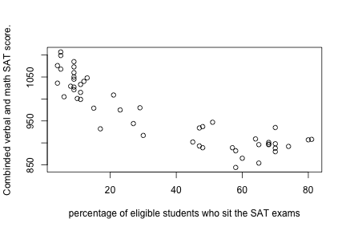

## Do smaller class sizes make a difference?
It's common knowledge that learning is better in small classes.  Is this really true? Take a look at the SAT scores to find out!

---

## Some states have more students sitting the SATs than others.

 
the graph is even cooler in the app!!
---
## Does paying teachers more make a difference?
The data suggests a trend that where teachers are paid more, more students sit the SAT exams. Maybe wealthier areas have a greater expectation of going to college.  Take a look at the data yourself! 

---
## Cool Stuff.
K-means clustering is a cool thing.  So it's part of the app.  Because its cool - that's reason enough.

